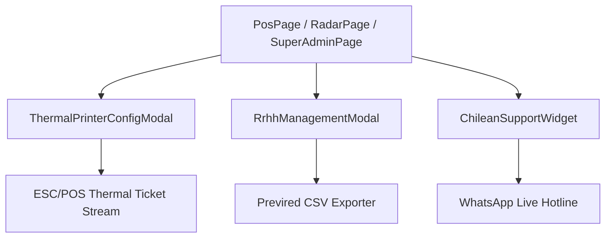

# Design Document: fase12-cobertura-total-20-modulos-saas

## Architecture & Component Breakdown

### Component Details
1. `ThermalPrinterConfigModal.jsx`: Modal de gestión de impresoras térmicas cloud.
2. `RrhhManagementModal.jsx`: Modal de RRHH corporativo, asistencia y archivo Previred.
3. `ChileanSupportWidget.jsx`: Widget interactivo de soporte 24/7 chileno.
