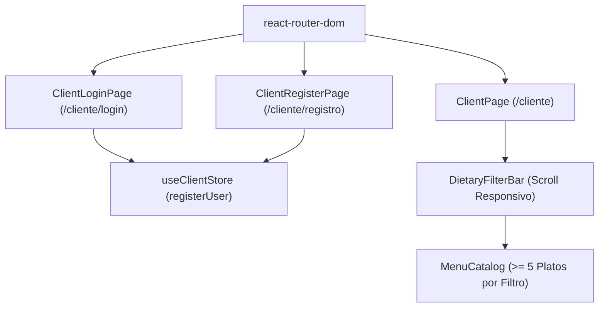

# Design Document: Fase 14 — Login, Registro Ley 21.716 y Filtros Responsivos

## Arquitectura e Interacción de Componentes

## Estrategia de Estilos y UX Móvil
1. **Contenedor del Scroll de Filtros**:
   - `flex items-center gap-2 overflow-x-auto pb-2 scrollbar-none whitespace-nowrap px-1 max-w-full`
2. **Formularios de Autenticación**:
   - Tarjeta central glassmorphism con botones neón y aviso de ley chilena de protección de datos personales.
