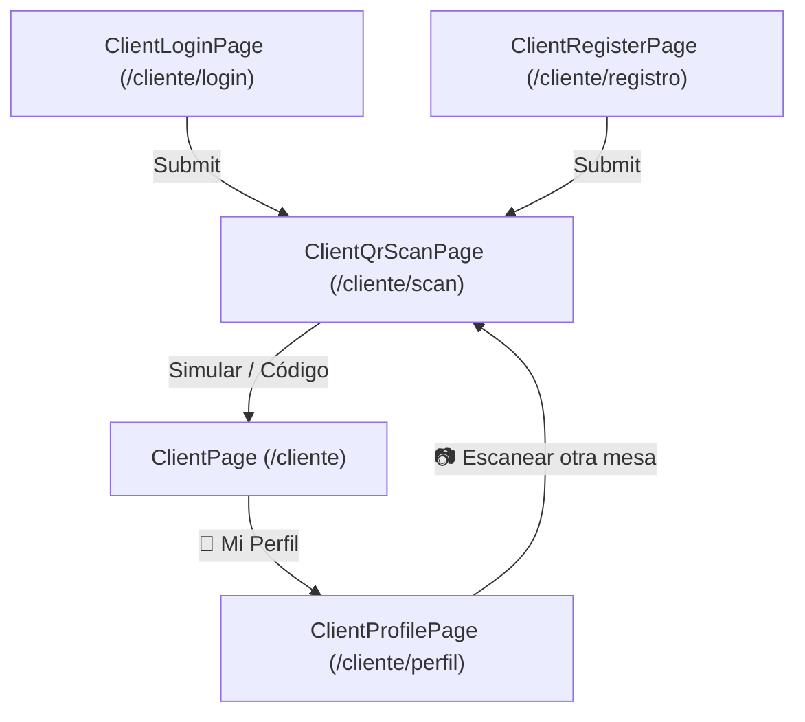

# Design Document: Fase 15 — Escaneo QR y Perfil Completo

## Diagrama de Flujo del Usuario

```mermaid
graph TD
    Login["ClientLoginPage (/cliente/login)"] -->|Submit| ScanView["ClientQrScanPage (/cliente/scan)"]
    Register["ClientRegisterPage (/cliente/registro)"] -->|Submit| ScanView
    ScanView -->|Simular / Código| TableView["ClientPage (/cliente)"]
    TableView -->|👤 Mi Perfil| ProfileView["ClientProfilePage (/cliente/perfil)"]
    ProfileView -->|📷 Escanear otra mesa| ScanView
```
