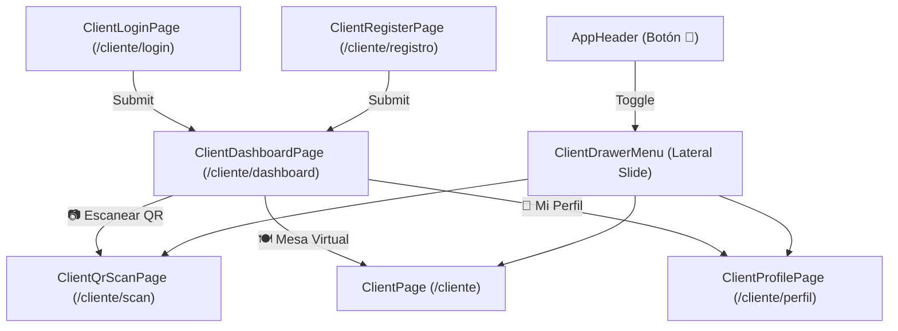

# Design Document: Fase 16 — Dashboard de Cliente y Menú Lateral

## Flujo de Navegación del Dashboard de Cliente

```mermaid
graph TD
    Login["ClientLoginPage (/cliente/login)"] -->|Submit| Dashboard["ClientDashboardPage (/cliente/dashboard)"]
    Register["ClientRegisterPage (/cliente/registro)"] -->|Submit| Dashboard
    
    Header["AppHeader (Botón 🍔)"] -->|Toggle| DrawerMenu["ClientDrawerMenu (Lateral Slide)"]
    
    Dashboard -->|📷 Escanear QR| ScanView["ClientQrScanPage (/cliente/scan)"]
    Dashboard -->|🍽️ Mesa Virtual| ClientPage["ClientPage (/cliente)"]
    Dashboard -->|👤 Mi Perfil| ProfileView["ClientProfilePage (/cliente/perfil)"]
    
    DrawerMenu --> ScanView
    DrawerMenu --> ClientPage
    DrawerMenu --> ProfileView
```
