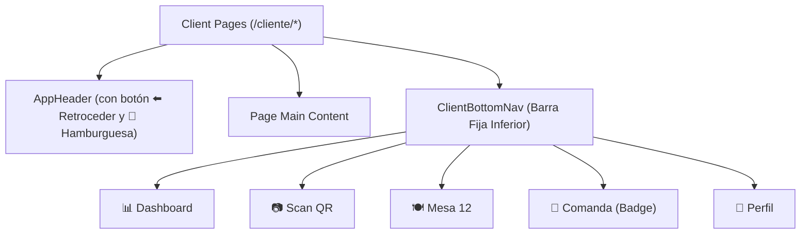

# Design Document: Fase 17 — Layout de Navegación Inferior Móvil

## Estructura Visual del Layout Móvil

```mermaid
graph TD
    ClientPages["Client Pages (/cliente/*)"] --> TopHeader["AppHeader (con botón ⬅️ Retroceder y 🍔 Hamburguesa)"]
    ClientPages --> PageContent["Page Main Content"]
    ClientPages --> BottomNav["ClientBottomNav (Barra Fija Inferior)"]

    BottomNav --> DashboardTab["📊 Dashboard"]
    BottomNav --> ScanTab["📷 Scan QR"]
    BottomNav --> TableTab["🍽️ Mesa 12"]
    BottomNav --> CartTab["🛒 Comanda (Badge)"]
    BottomNav --> ProfileTab["👤 Perfil"]
```
