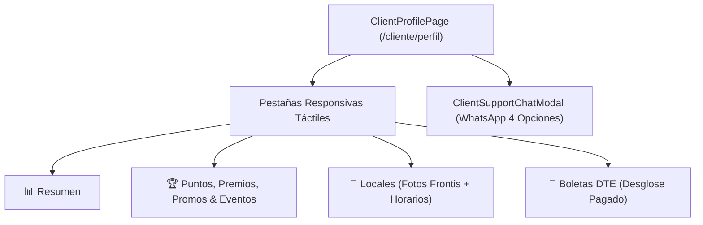

# Design Document: Fase 19 — Perfil Interactivo y Chat de Soporte WhatsApp

```mermaid
graph TD
    Profile["ClientProfilePage (/cliente/perfil)"] --> ResponsiveTabs["Pestañas Responsivas Táctiles"]
    ResponsiveTabs --> OverviewTab["📊 Resumen"]
    ResponsiveTabs --> RewardsTab["🏆 Puntos, Premios, Promos & Eventos"]
    ResponsiveTabs --> BranchesTab["📍 Locales (Fotos Frontis + Horarios)"]
    ResponsiveTabs --> InvoicesTab["📜 Boletas DTE (Desglose Pagado)"]
    
    Profile --> SupportChat["ClientSupportChatModal (WhatsApp 4 Opciones)"]
```
