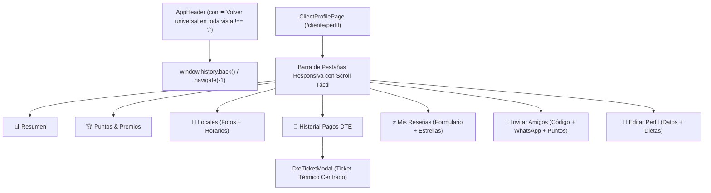

# Design Document: Fase 20 — Botón Retroceder Universal y Perfil Completo

```mermaid
graph TD
    AppHeader["AppHeader (con ⬅️ Volver universal en toda vista !== '/')"] --> BackAction["window.history.back() / navigate(-1)"]
    
    ProfilePage["ClientProfilePage (/cliente/perfil)"] --> HorizontalTabs["Barra de Pestañas Responsiva con Scroll Táctil"]
    
    HorizontalTabs --> OverviewTab["📊 Resumen"]
    HorizontalTabs --> RewardsTab["🏆 Puntos & Premios"]
    HorizontalTabs --> BranchesTab["📍 Locales (Fotos + Horarios)"]
    HorizontalTabs --> PaymentsTab["📜 Historial Pagos DTE"] --> DteModal["DteTicketModal (Ticket Térmico Centrado)"]
    HorizontalTabs --> ReviewsTab["⭐ Mis Reseñas (Formulario + Estrellas)"]
    HorizontalTabs --> ReferralsTab["👥 Invitar Amigos (Código + WhatsApp + Puntos)"]
    HorizontalTabs --> EditProfileTab["👤 Editar Perfil (Datos + Dietas)"]
```
