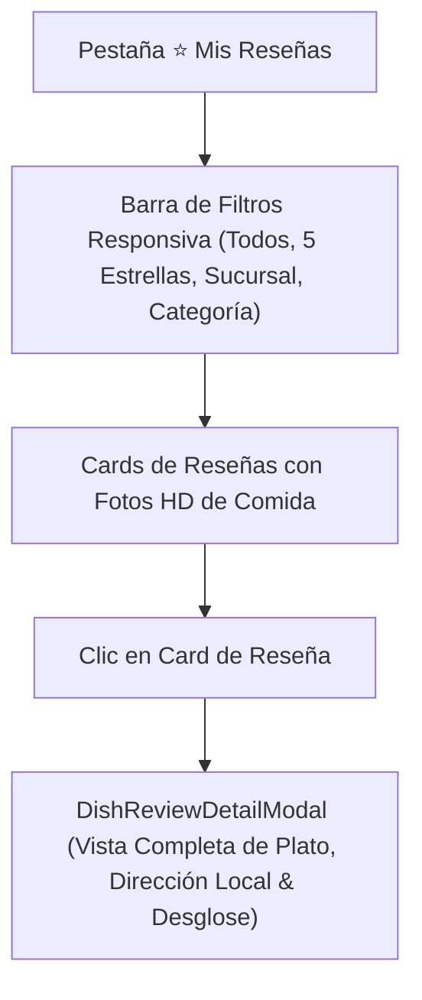

# Design Document: Fase 21 — Reseñas Interactivas de Platos con Modal y Filtros

```mermaid
graph TD
    ReviewsTab["Pestaña ⭐ Mis Reseñas"] --> MobileFilterBar["Barra de Filtros Responsiva (Todos, 5 Estrellas, Sucursal, Categoría)"]
    MobileFilterBar --> FilteredCards["Cards de Reseñas con Fotos HD de Comida"]
    FilteredCards --> ClickCard["Clic en Card de Reseña"] --> DishModal["DishReviewDetailModal (Vista Completa de Plato, Dirección Local & Desglose)"]
```
