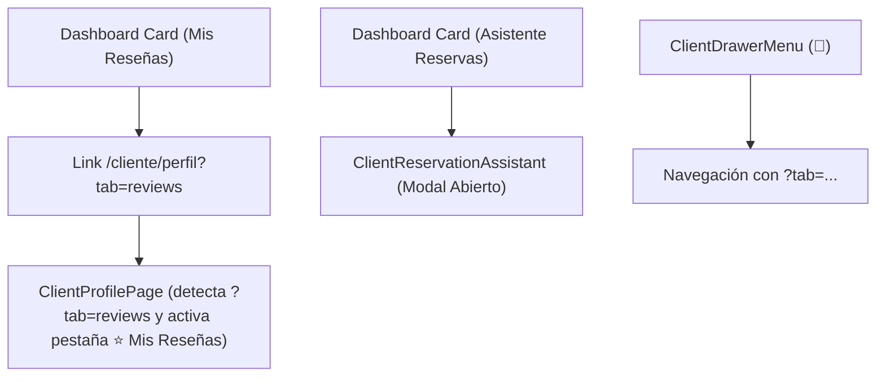

# Design Document: Fase 22 — Sincronización de Navegación y Pestañas

```mermaid
graph TD
    DashboardCard["Dashboard Card (Mis Reseñas)"] --> LinkReviews["Link /cliente/perfil?tab=reviews"]
    DashboardCardRes["Dashboard Card (Asistente Reservas)"] --> ModalBooking["ClientReservationAssistant (Modal Abierto)"]
    DrawerMenu["ClientDrawerMenu (🍔)"] --> NavTabLinks["Navegación con ?tab=..."]
    
    LinkReviews --> ProfilePage["ClientProfilePage (detecta ?tab=reviews y activa pestaña ⭐ Mis Reseñas)"]
```
