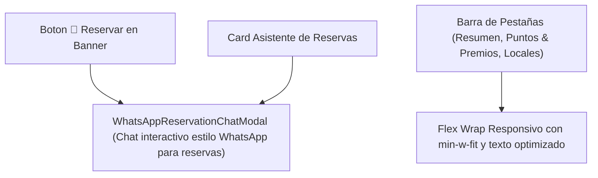

# Design Document: Fase 23 — Modal de Conversación de Reserva y Pestañas Responsivas

```mermaid
graph TD
    BannerButton["Boton 📅 Reservar en Banner"] --> WhatsAppModal["WhatsAppReservationChatModal (Chat interactivo estilo WhatsApp para reservas)"]
    CardAssistant["Card Asistente de Reservas"] --> WhatsAppModal
    
    TabNav["Barra de Pestañas (Resumen, Puntos & Premios, Locales)"] --> ResponsiveFlex["Flex Wrap Responsivo con min-w-fit y texto optimizado"]
```
