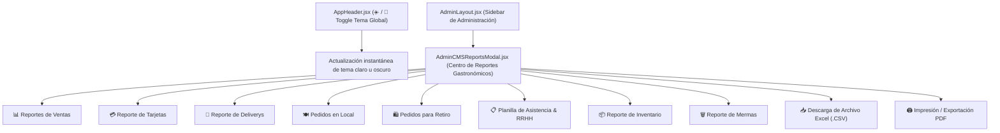

# Design Document: Fase 25 — Tema Claro/Oscuro y Reportes CMS Administrativos Excel

```mermaid
graph TD
    AppHeader["AppHeader.jsx (☀️ / 🌙 Toggle Tema Global)"] --> ThemeState["Actualización instantánea de tema claro u oscuro"]
    AdminSidebar["AdminLayout.jsx (Sidebar de Administración)"] --> CMSReportsModal["AdminCMSReportsModal.jsx (Centro de Reportes Gastronómicos)"]
    
    CMSReportsModal --> SalesReport["📊 Reportes de Ventas"]
    CMSReportsModal --> CardsReport["💳 Reporte de Tarjetas"]
    CMSReportsModal --> DeliveryReport["🛵 Reporte de Deliverys"]
    CMSReportsModal --> DineInReport["🍽️ Pedidos en Local"]
    CMSReportsModal --> TakeoutReport["🛍️ Pedidos para Retiro"]
    CMSReportsModal --> StaffReport["📋 Planilla de Asistencia & RRHH"]
    CMSReportsModal --> InventoryReport["📦 Reporte de Inventario"]
    CMSReportsModal --> WasteReport["🗑️ Reporte de Mermas"]

    CMSReportsModal --> ExportExcel["📥 Descarga de Archivo Excel (.CSV)"]
    CMSReportsModal --> PrintReport["🖨️ Impresión / Exportación PDF"]
```
