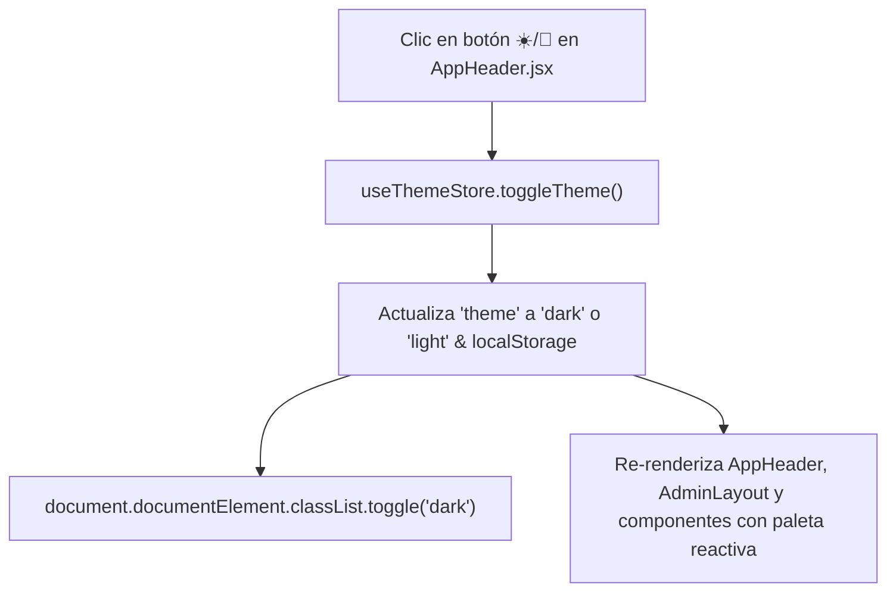

# Design Document: Fase 26 — Selector de Tema Claro/Oscuro Funcional

```mermaid
graph TD
    UserClick["Clic en botón ☀️/🌙 en AppHeader.jsx"] --> ToggleStore["useThemeStore.toggleTheme()"]
    ToggleStore --> UpdateState["Actualiza 'theme' a 'dark' o 'light' & localStorage"]
    UpdateState --> DOMClass["document.documentElement.classList.toggle('dark')"]
    UpdateState --> ReRender["Re-renderiza AppHeader, AdminLayout y componentes con paleta reactiva"]
```
