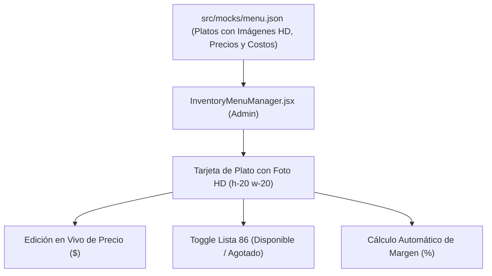

# Design Document: Fase 27 — Imágenes Reales de la Carta en Inventario Admin

```mermaid
graph TD
    MenuData["src/mocks/menu.json (Platos con Imágenes HD, Precios y Costos)"] --> InventoryManager["InventoryMenuManager.jsx (Admin)"]
    InventoryManager --> Card["Tarjeta de Plato con Foto HD (h-20 w-20)"]
    Card --> PriceControl["Edición en Vivo de Precio ($)"]
    Card --> StockControl["Toggle Lista 86 (Disponible / Agotado)"]
    Card --> MarginBadge["Cálculo Automático de Margen (%)"]
```
