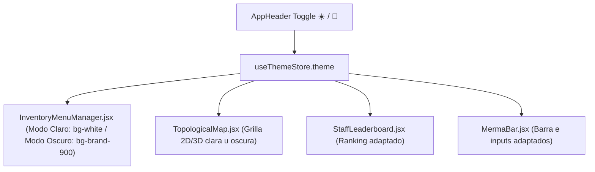

# Design Document: Fase 28 — Soporte de Tema Claro/Oscuro en Tarjetas Admin

```mermaid
graph TD
    AppHeaderToggle["AppHeader Toggle ☀️ / 🌙"] --> ThemeStore["useThemeStore.theme"]
    ThemeStore --> Inventory["InventoryMenuManager.jsx (Modo Claro: bg-white / Modo Oscuro: bg-brand-900)"]
    ThemeStore --> Map["TopologicalMap.jsx (Grilla 2D/3D clara u oscura)"]
    ThemeStore --> Leaderboard["StaffLeaderboard.jsx (Ranking adaptado)"]
    ThemeStore --> Merma["MermaBar.jsx (Barra e inputs adaptados)"]
```
