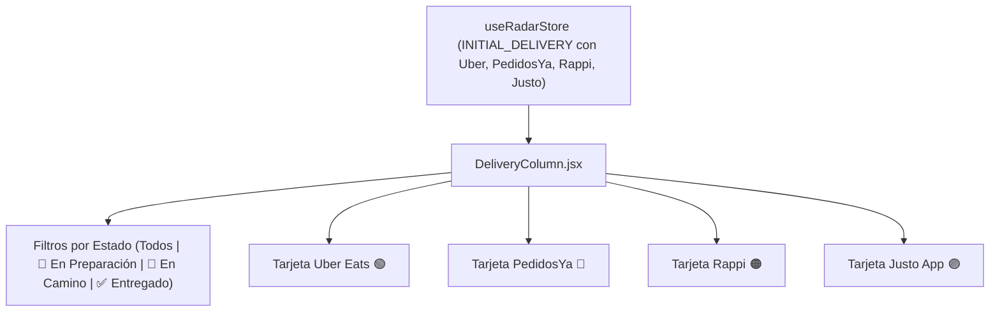

# Design Document: Fase 29 — Tarjetas Delivery Omnicanal Uber, PedidosYa, Rappi, Justo

```mermaid
graph TD
    DeliveryStore["useRadarStore (INITIAL_DELIVERY con Uber, PedidosYa, Rappi, Justo)"] --> DeliveryCol["DeliveryColumn.jsx"]
    DeliveryCol --> StateFilter["Filtros por Estado (Todos | 🍳 En Preparación | 🛵 En Camino | ✅ Entregado)"]
    DeliveryCol --> CardUber["Tarjeta Uber Eats 🟢"]
    DeliveryCol --> CardPya["Tarjeta PedidosYa 🔴"]
    DeliveryCol --> CardRappi["Tarjeta Rappi 🟠"]
    DeliveryCol --> CardJusto["Tarjeta Justo App 🟣"]
```
