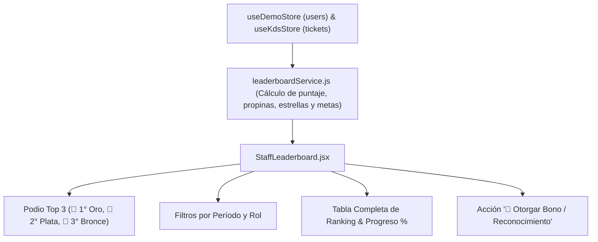

# Design Document: Fase 30 — Gamificación de Staff y Ranking de Desempeño

```mermaid
graph TD
    DataUsers["useDemoStore (users) & useKdsStore (tickets)"] --> Service["leaderboardService.js (Cálculo de puntaje, propinas, estrellas y metas)"]
    Service --> LeaderboardView["StaffLeaderboard.jsx"]
    LeaderboardView --> Podium["Podio Top 3 (🥇 1° Oro, 🥈 2° Plata, 🥉 3° Bronce)"]
    LeaderboardView --> Filters["Filtros por Período y Rol"]
    LeaderboardView --> DetailedTable["Tabla Completa de Ranking & Progreso %"]
    LeaderboardView --> RewardAction["Acción '🎁 Otorgar Bono / Reconocimiento'"]
```
