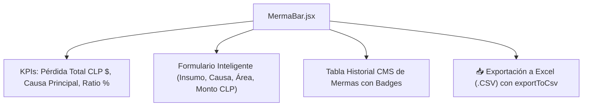

# Design Document: Fase 31 — Módulo Avanzado de Control de Mermas

```mermaid
graph TD
    MermaView["MermaBar.jsx"] --> KPIHeader["KPIs: Pérdida Total CLP $, Causa Principal, Ratio %"]
    MermaView --> InputForm["Formulario Inteligente (Insumo, Causa, Área, Monto CLP)"]
    MermaView --> HistoryTable["Tabla Historial CMS de Mermas con Badges"]
    MermaView --> ExportExcel["📥 Exportación a Excel (.CSV) con exportToCsv"]
```
