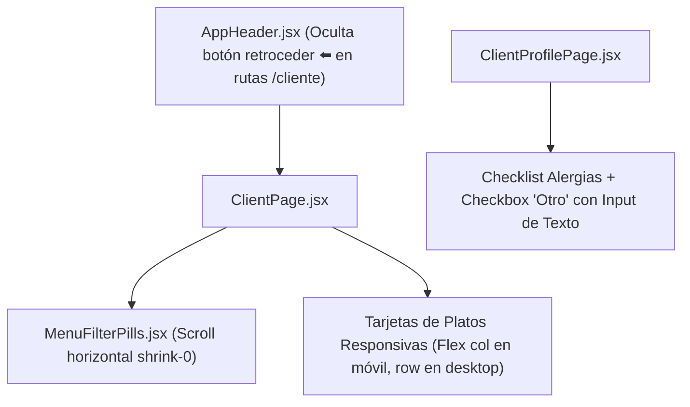

# Design Document: Fase 33 — Optimizaciones en Vista Cliente, Tarjetas de la Carta y Alergias Personalizadas en Perfil

```mermaid
graph TD
    AppHeader["AppHeader.jsx (Oculta botón retroceder ⬅️ en rutas /cliente)"] --> ClientPage["ClientPage.jsx"]
    ClientPage --> MenuFilterPills["MenuFilterPills.jsx (Scroll horizontal shrink-0)"]
    ClientPage --> ResponsiveDishCards["Tarjetas de Platos Responsivas (Flex col en móvil, row en desktop)"]
    ProfilePage["ClientProfilePage.jsx"] --> CustomAllergies["Checklist Alergias + Checkbox 'Otro' con Input de Texto"]
```
