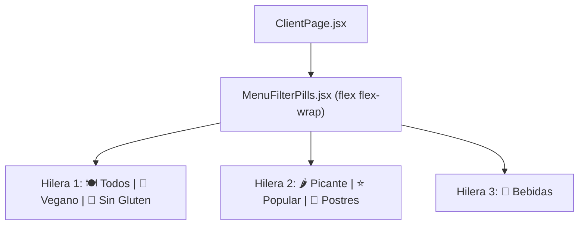

# Design Document: Fase 34 — Filtros en 3 Hileras Visibles para Móvil

```mermaid
graph TD
    ClientPage["ClientPage.jsx"] --> MenuFilterPills["MenuFilterPills.jsx (flex flex-wrap)"]
    MenuFilterPills --> Row1["Hilera 1: 🍽️ Todos | 🌱 Vegano | 🌾 Sin Gluten"]
    MenuFilterPills --> Row2["Hilera 2: 🌶️ Picante | ⭐ Popular | 🍰 Postres"]
    MenuFilterPills --> Row3["Hilera 3: 🍹 Bebidas"]
```
