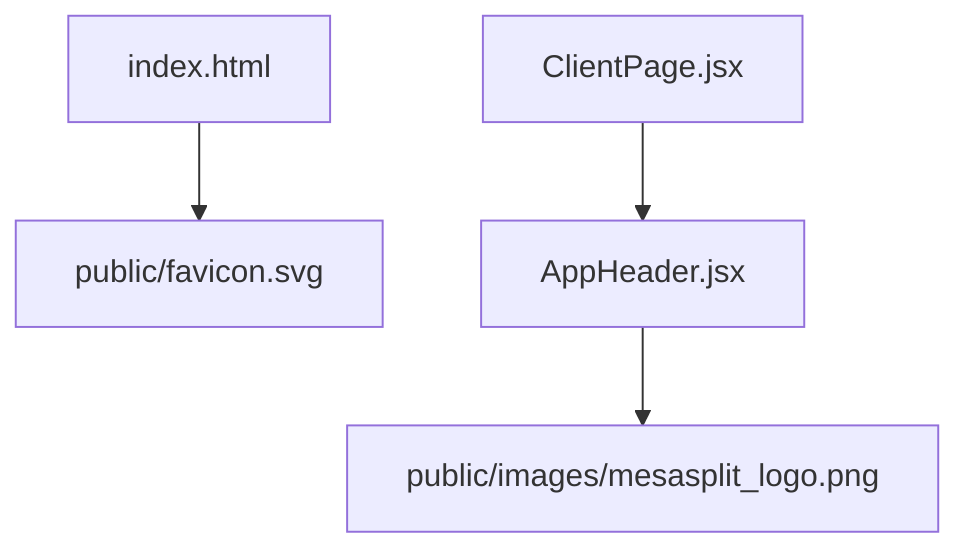

# Design Document: Fase 35 — AppHeader, Logo y Favicon en Mesa Virtual

```mermaid
graph TD
    IndexHTML["index.html"] --> FaviconSVG["public/favicon.svg"]
    AppHeader["AppHeader.jsx"] --> LogoPNG["public/images/mesasplit_logo.png"]
    ClientPage["ClientPage.jsx"] --> AppHeader
```
