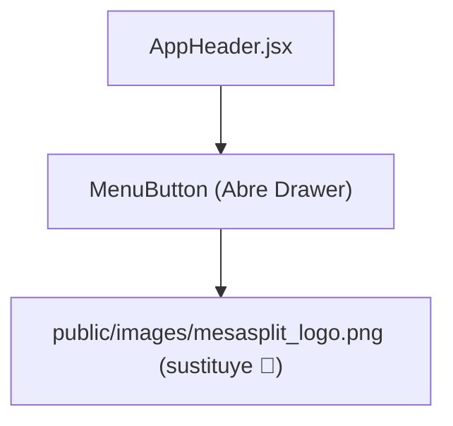

# Design Document: Fase 36 — Reemplazar Hamburguesa por Logo Oficial en AppHeader

```mermaid
graph TD
    AppHeader["AppHeader.jsx"] --> MenuButton["MenuButton (Abre Drawer)"]
    MenuButton --> LogoPNG["public/images/mesasplit_logo.png (sustituye 🍔)"]
```
