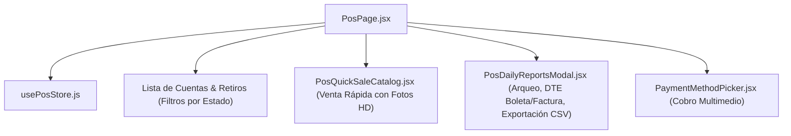

# Design Document: Fase 37 — Vista de Caja POS Dinámica

```mermaid
graph TD
    PosPage["PosPage.jsx"] --> Store["usePosStore.js"]
    PosPage --> OpenBillsList["Lista de Cuentas & Retiros (Filtros por Estado)"]
    PosPage --> QuickSaleCatalog["PosQuickSaleCatalog.jsx (Venta Rápida con Fotos HD)"]
    PosPage --> DailyReportsModal["PosDailyReportsModal.jsx (Arqueo, DTE Boleta/Factura, Exportación CSV)"]
    PosPage --> PaymentPanel["PaymentMethodPicker.jsx (Cobro Multimedio)"]
```
