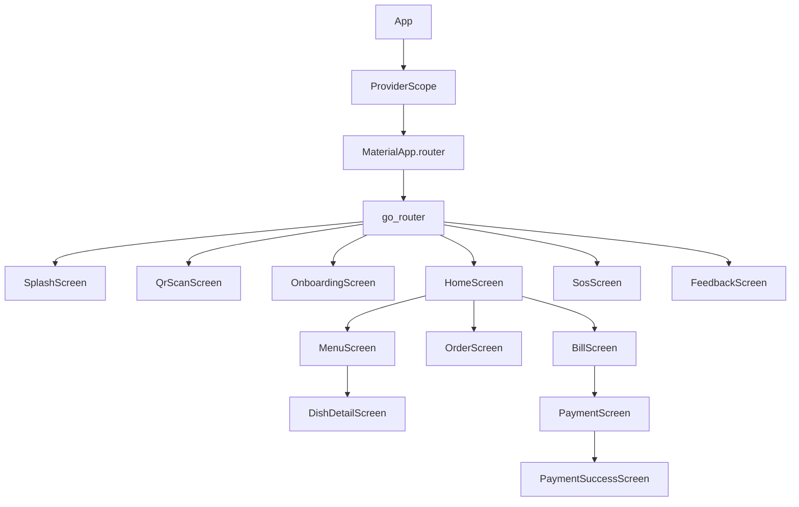

# Design: Hito MVP App Mobile — LabTab Comensal

## Arquitectura

```
┌─────────────────────────────────────────────┐
│                Presentation                 │
│  Screens + Widgets + Providers (Riverpod)   │
├─────────────────────────────────────────────┤
│                 Domain                      │
│  Entities + Repository Interfaces           │
├─────────────────────────────────────────────┤
│                  Data                       │
│  API Datasources + Repository Impl + Models │
├─────────────────────────────────────────────┤
│               Core/Shared                   │
│  Dio Client + Interceptors + Storage + Models│
└─────────────────────────────────────────────┘
```

## Flujo de Autenticación

```
QR Scan → POST /auth/guest-session → {accessToken, guest}
         ↓
    SecureStorage.saveAccessToken()
         ↓
    OnboardingScreen (nombre, alergias)
         ↓
    HomeScreen (menú)
```

## Flujo de Pedido

```
DishDetailScreen → CartNotifier.addItem() → CartState (local)
                                              ↓
OrderScreen → OrderSubmitNotifier.submitOrder() → POST /orders
                                              ↓
    SessionOrdersNotifier (polling cada 10s) → GET /sessions/{id}/orders
```

## Flujo de Pago

```
BillScreen → GET /sessions/{id}/bill + GET /bills/{id}/summary-by-guest
    ↓
PaymentScreen → Selección método + propina
    ↓
POST /payments → PaymentSuccessScreen
```

## Decisiones de Diseño

### 1. Carrito como StateNotifier puro
- Sin repository: el carrito es estado local
- Se pierde al cerrar app (aceptable para MVP)
- `CartNotifier` con `addItem`, `removeItem`, `updateQuantity`, `clear`

### 2. ApiResponse unwrap en datasources
- Cada datasource llama `ApiResponse.fromJson()` y extrae `data`
- Repositorios son thin wrappers que pasan el resultado
- Evita double-unwrap y mantiene los repos limpios

### 3. Polling con Timer
- `SessionOrdersNotifier` inicia Timer en constructor
- Cancela en `dispose()`
- Intervalo: 10 segundos (configurable en `PollingConstants`)

### 4. Error handling con sealed classes
```dart
sealed class AppException implements Exception {
  final String message;
  const AppException(this.message);
}
class NetworkException extends AppException { ... }
class ServerException extends AppException { ... }
class AuthException extends AppException { ... }
```

### 5. Rutas con ShellRoute
```
/splash → /qr-scan → /onboarding → /login
                                      ↓
                              HomeScreen (ShellRoute)
                              ├── /menu (Menú)
                              │   └── /menu/:dishId
                              ├── /orders (Pedidos)
                              └── /bill (Cuenta)
                                      ↓
                              /payment → /payment-success
                              /sos
                              /feedback
```

## Diagrama de Componentes


