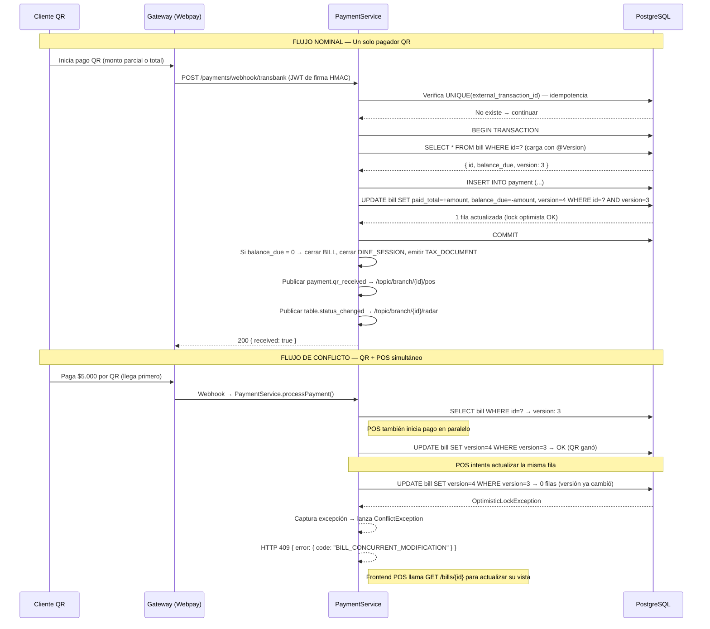
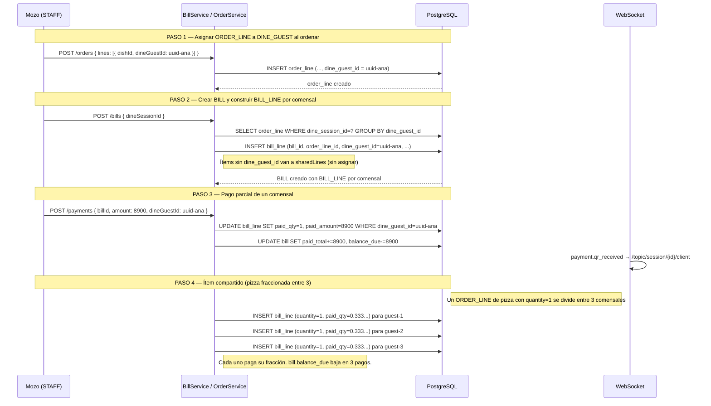
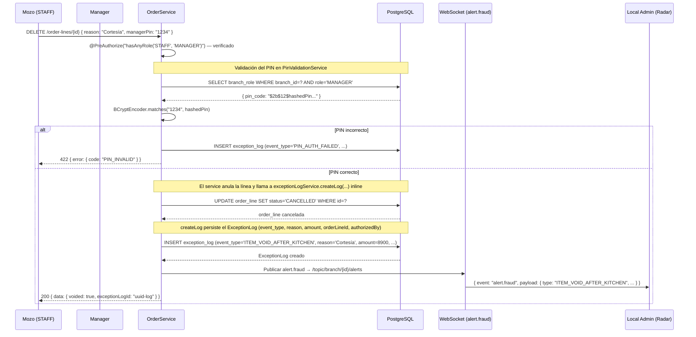
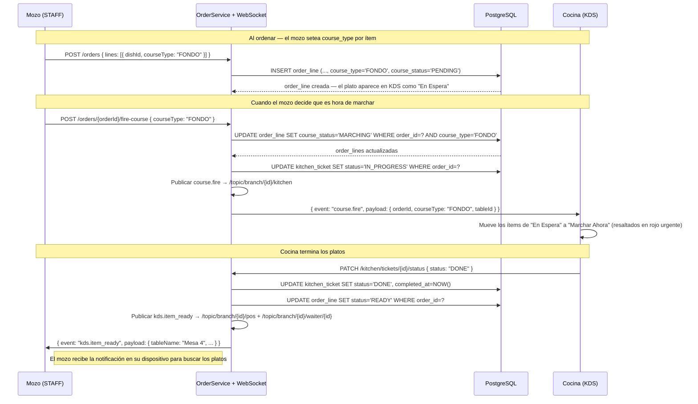
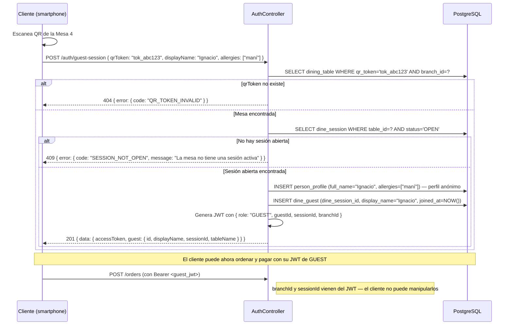

# Flujos Críticos del Backend — LabTab

**Versión**: 1.0  
**Stack**: Java 21 + Spring Boot 3.3.x + STOMP WebSocket  
**Referencia**: `openspec/docs/Diagrama_V3.mmd` — entidades BILL, PAYMENT, ORDER_LINE, DINE_GUEST

Este documento define el orden correcto de operaciones en los 5 flujos de mayor
complejidad. Cada flujo incluye diagrama de secuencia Mermaid y notas de
implementación. Los flujos aquí definidos son el contrato — si el código difiere,
es un bug.

---

## Flujo 1 — Pago QR y Concurrencia (Sincronización Híbrida)

Este es el flujo de mayor riesgo del sistema. Ocurre cuando un cliente paga por QR
mientras el cajero tiene la misma cuenta abierta en el POS. Sin control de concurrencia,
puede resultar en cobro duplicado.

### Decisión de concurrencia

**Lock optimista con `@Version` en `BILL`** (ver Doc 06b, sección 4.4).

- **Caso nominal** (un solo pagador): sin contención, máximo throughput.
- **Caso de conflicto** (QR + POS simultáneo): la segunda transacción recibe
  `OptimisticLockException` → Spring devuelve `409 Conflict` con mensaje claro.
- **Caso de cierre de caja**: se usa `SELECT FOR UPDATE` (lock pesimista) solo
  en `BillRepository.findByIdForUpdate()` — la operación de cierre no puede fallar.



### Idempotencia de pagos

```java
// services/implement/PaymentServiceImpl.java
@Transactional
// La auditoría de operaciones sensibles es inline: exceptionLogService.createLog(eventType, reason, amount, orderLineId, authorizedBy)
public PaymentResponse processPayment(CreatePaymentRequest request) {

    // 1. Verificar idempotencia: si ya existe el external_transaction_id, devolver el pago original
    Optional<Payment> existingPayment =
        paymentRepository.findByExternalTransactionId(request.externalTransactionId());

    if (existingPayment.isPresent()) {
        // 409 controlado — el frontend no debe reintentar automáticamente
        throw new ConflictException(
            "PAYMENT_DUPLICATE",
            "Pago ya procesado",
            existingPayment.get()
        );
    }

    // 2. Cargar el BILL con lock optimista (@Version lo gestiona Hibernate)
    Bill bill = billRepository.findById(request.billId())
        .orElseThrow(() -> new ResourceNotFoundException("Bill no encontrado"));

    // 3. Validar que el monto no supere el balance_due
    if (request.amount().compareTo(bill.getBalanceDue()) > 0) {
        throw new BusinessRuleException("AMOUNT_EXCEEDS_BALANCE",
            "El monto supera el saldo pendiente");
    }

    // 4. Crear el pago
    Payment payment = paymentMapper.toEntity(request);
    payment.setBranchId(BranchContextHolder.get());
    payment = paymentRepository.save(payment);

    // 5. Actualizar el BILL (Hibernate compara @Version automáticamente)
    bill.setPaidTotal(bill.getPaidTotal().add(request.amount()));
    bill.setBalanceDue(bill.getBalanceDue().subtract(request.amount()));

    // 6. Si balance_due = 0 → cerrar la cuenta y la sesión
    if (bill.getBalanceDue().compareTo(BigDecimal.ZERO) == 0) {
        bill.setStatus(BillStatusEnum.PAID);
        closeDineSession(bill.getDineSessionId());
        taxDocumentService.issueAsync(bill);  // Emite DTE en background sin bloquear
    }

    billRepository.save(bill);  // Aquí puede fallar con OptimisticLockException → 409

    // 7. Publicar eventos WebSocket
    paymentEventPublisher.publishQrReceived(payment);
    tableEventPublisher.publishStatusChanged(bill.getDineSessionId());

    return paymentMapper.toResponse(payment, bill);
}
```

---

## Flujo 2 — División por Ítem (DINE_GUEST + BILL_LINE + PAYMENT)

El flujo central del producto. Un ítem puede ser compartido entre múltiples comensales
(fraccionado) o pertenecer a uno solo.



### Construcción de BILL_LINE por comensal

```java
// services/implement/BillServiceImpl.java
@Transactional
public BillResponse createBill(CreateBillRequest request) {

    DineSession session = dineSessionRepository.findById(request.dineSessionId())
        .orElseThrow(() -> new ResourceNotFoundException("Sesión no encontrada"));

    // Obtener todas las ORDER_LINE de la sesión (que no estén canceladas)
    List<OrderLine> lines = orderLineRepository
        .findByDineSessionIdAndStatusNot(session.getId(), OrderStatusEnum.CANCELLED);

    // Crear el BILL con totales calculados
    Bill bill = new Bill();
    bill.setDineSessionId(session.getId());
    bill.setBranchId(BranchContextHolder.get());
    bill.setStatus(BillStatusEnum.OPEN);
    bill.setServiceChargePct(request.serviceChargePct());

    BigDecimal subtotal = lines.stream()
        .map(OrderLine::getLineTotal)
        .reduce(BigDecimal.ZERO, BigDecimal::add);

    bill.setSubtotal(subtotal);
    BigDecimal serviceCharge = subtotal.multiply(
        request.serviceChargePct().divide(BigDecimal.valueOf(100)));
    bill.setServiceChargeAmount(serviceCharge);
    bill.setTotalAmount(subtotal.add(serviceCharge));
    bill.setBalanceDue(bill.getTotalAmount());
    bill = billRepository.save(bill);

    // Construir BILL_LINE por cada ORDER_LINE (agrupadas por DINE_GUEST)
    for (OrderLine line : lines) {
        BillLine billLine = new BillLine();
        billLine.setBillId(bill.getId());
        billLine.setOrderLineId(line.getId());
        billLine.setDishId(line.getDishId());
        billLine.setDineGuestId(line.getDineGuestId());  // null = ítem compartido
        billLine.setName(line.getName());
        billLine.setQuantity(line.getQuantity());
        billLine.setUnitPrice(line.getUnitPrice());
        billLine.setLineTotal(line.getLineTotal());
        billLine.setPaidQty(BigDecimal.ZERO);
        billLine.setPaidAmount(BigDecimal.ZERO);
        billLine.setStatus(BillLineStatusEnum.ACTIVE);
        billLineRepository.save(billLine);
    }

    return billMapper.toResponse(bill);
}
```

---

## Flujo 3 — Anulación con PIN (Antifraude)



### Auditoría inline (sin AOP)

La auditoría antifraude ya no usa AOP: la anotación `@Auditable` y el `AuditAspect`
fueron eliminados. Las operaciones sensibles (anulación, descuento, reembolso) llaman
de forma explícita a `exceptionLogService.createLog(eventType, reason, amount, orderLineId, authorizedBy)`
dentro del método de servicio, con el contexto completo.

```java
// services/implement/OrderServiceImpl.java — anulación inline
exceptionLogService.createLog(
    sentToKitchen
        ? ExceptionEventTypeEnum.ITEM_VOID_AFTER_KITCHEN
        : ExceptionEventTypeEnum.ITEM_VOID_PRE_KITCHEN,
    request.reason(),      // reason
    null,                  // amount (no aplica en anulación)
    line.getId(),          // orderLineId
    authorizedBy);         // authorizedBy (personId del MANAGER que autorizó)

// services/implement/BillServiceImpl.java — descuento manual inline
exceptionLogService.createLog(ExceptionEventTypeEnum.MANUAL_DISCOUNT,
    request.reason(), request.discountAmount(), null, authorizer.getPersonId());

// services/implement/PaymentServiceImpl.java — reembolso inline
exceptionLogService.createLog(ExceptionEventTypeEnum.REFUND_ISSUED,
    request.reason(), payment.getTotalAmount(), null, authorizer.getPersonId());
```

---

## Flujo 4 — Course Control / Marchar Tiempos

Permite al mozo controlar cuándo se sirven los platos (entrada, fondo, postre).



---

## Flujo 5 — Onboarding QR del Cliente (Sesión Sin Auth)



### Validaciones del onboarding QR

```java
// services/implement/AuthServiceImpl.java
@Transactional
public GuestAuthResponse guestSession(GuestSessionRequest request) {

    // 1. Validar qrToken — si no existe o está inactiva la mesa → 404
    DineTable table = dineTableRepository
        .findByQrTokenAndBranchId(request.qrToken(), extractBranchFromToken(request.qrToken()))
        .orElseThrow(() -> new ResourceNotFoundException("QR_TOKEN_INVALID", "Mesa no encontrada"));

    // 2. Verificar sesión abierta — la mesa debe tener una DINE_SESSION activa
    DineSession session = dineSessionRepository
        .findByDineTableIdAndStatus(table.getId(), DineSessionStatusEnum.OPEN)
        .orElseThrow(() -> new ConflictException("SESSION_NOT_OPEN",
            "La mesa no tiene una sesión activa"));

    // 3. Crear perfil anónimo si el cliente proporcionó su nombre
    PersonProfile guestProfile = null;
    if (request.displayName() != null) {
        guestProfile = new PersonProfile();
        guestProfile.setFullName(request.displayName());
        guestProfile.setAllergies(request.allergies() != null ? request.allergies() : List.of());
        guestProfile.setRole("guest");
        guestProfile = personProfileRepository.save(guestProfile);
    }

    // 4. Crear DINE_GUEST — el comensal en la sesión
    DineGuest guest = new DineGuest();
    guest.setDineSessionId(session.getId());
    guest.setPersonId(guestProfile != null ? guestProfile.getPersonId() : null);
    guest.setDisplayName(request.displayName() != null ? request.displayName() : "Cliente " + UUID.randomUUID().toString().substring(0, 4));
    guest.setTempLabel("Cliente " + (dineGuestRepository.countByDineSessionId(session.getId()) + 1));
    guest.setJoinedAt(Instant.now());
    guest = dineGuestRepository.save(guest);

    // 5. Generar JWT de GUEST con sessionId y branchId
    String accessToken = jwtService.generateGuestToken(guest, session, table.getBranchId());

    return new GuestAuthResponse(accessToken, 14400, guestMapper.toResponse(guest, table));
}
```

---

## Estrategia de Testing

> El hallazgo de la auditoría de los repos V0 (Node) y V1 (Python): **cero tests**.
> Este documento establece el mínimo no negociable para el backend Java.

### Stack de Testing

**JUnit 5 + Testcontainers** — **NO H2 en memoria**.

| Por qué NO H2 | Por qué SÍ Testcontainers |
|:---|:---|
| Los tipos `TEXT[]` de Hypersistence Utils no funcionan en H2 | Levanta PostgreSQL 16 real en Docker durante el test |
| Las funciones JSONB de PostgreSQL no existen en H2 | El mismo `postgres:16-alpine` que en producción |
| Tests en H2 que pasan pueden fallar en PostgreSQL real | Paridad total dev → staging → producción |
| El constraint `UNIQUE(external_transaction_id)` se comporta distinto | Los constraints y constraints CHECK son los mismos SQL |

### Tests mínimos no negociables

| Test | Tipo | Clase | Razón |
|:---|:---|:---|:---|
| Aislamiento por `branchId` — usuario A no ve recursos de sucursal B | Integración | `BranchIsolationIntegrationTest` | La vulnerabilidad más crítica del sistema multi-tenant |
| Idempotencia de pagos — webhook duplicado no crea pago doble | Integración | `PaymentIntegrationTest` | Cobro duplicado es pérdida de dinero directa |
| Validación de PIN correcto e incorrecto | Unitario | `PinValidationServiceTest` | Regla de negocio antifraude central |
| Lock optimista en BILL — pago QR + POS simultáneo → 409 | Integración | `BillConcurrencyIntegrationTest` | Escenario de Sincronización Híbrida |
| Construcción de BILL_LINE por DINE_GUEST | Unitario | `BillServiceTest` | División de cuentas es el core del producto |
| Autorización de canales STOMP por `branchId` | Integración | `StompAuthIntegrationTest` | Superficie de ataque WebSocket documentada en Doc 07 |
| Emisión automática de `EXCEPTION_LOG` en anulación | Integración | `ApplyDiscountAuditIntegrationTest` | Trazabilidad antifraude — debe ser automático |

### Ejemplo de test de integración con Testcontainers

```java
// test/integration/PaymentIntegrationTest.java
@SpringBootTest(webEnvironment = SpringBootTest.WebEnvironment.RANDOM_PORT)
@Testcontainers
@ActiveProfiles("test")
class PaymentIntegrationTest {

    // Levanta un contenedor PostgreSQL 16 para este test (compartido entre métodos)
    @Container
    static PostgreSQLContainer<?> postgres = new PostgreSQLContainer<>("postgres:16-alpine")
        .withDatabaseName("labtab_test")
        .withUsername("test")
        .withPassword("test");

    @DynamicPropertySource
    static void configureDataSource(DynamicPropertyRegistry registry) {
        registry.add("spring.datasource.url", postgres::getJdbcUrl);
        registry.add("spring.datasource.username", postgres::getUsername);
        registry.add("spring.datasource.password", postgres::getPassword);
    }

    @Test
    @DisplayName("Un webhook duplicado de Webpay devuelve 409 — no crea pago doble")
    void webhookDuplicado_devuelve409_sinCrearPagoDoble() {
        // GIVEN: un pago ya procesado con externalTransactionId = "TB-12345"
        crearPagoDePrueba("TB-12345");

        // WHEN: el mismo webhook llega dos veces
        CreatePaymentRequest requestDuplicado = new CreatePaymentRequest(
            billId, BigDecimal.valueOf(5000), null, BigDecimal.valueOf(5000),
            PaymentMethodEnum.WEBPAY, "transbank", "TB-12345", "CLP", null
        );

        // THEN: la segunda llamada devuelve 409 con el pago original
        assertThatThrownBy(() -> paymentService.processPayment(requestDuplicado))
            .isInstanceOf(ConflictException.class)
            .hasFieldOrPropertyWithValue("errorCode", "PAYMENT_DUPLICATE");

        // Y solo existe UN pago con ese externalTransactionId en la DB
        long count = paymentRepository.countByExternalTransactionId("TB-12345");
        assertThat(count).isEqualTo(1);
    }
}
```

### Ejemplo de test de lock optimista

```java
// test/integration/BillConcurrencyIntegrationTest.java
@Test
@DisplayName("Pago QR y POS simultáneo — uno de los dos recibe 409 Conflict")
void pagoConcurrente_lockOptimista_unoPaga_otroRecibe409() throws Exception {

    // GIVEN: un BILL con balance_due = 10000
    UUID billId = crearBillDePrueba(BigDecimal.valueOf(10000));

    // WHEN: dos hilos intentan pagar al mismo tiempo
    ExecutorService executor = Executors.newFixedThreadPool(2);
    CountDownLatch startLatch = new CountDownLatch(1);
    List<Exception> excepciones = new CopyOnWriteArrayList<>();

    Callable<Void> pagarTarea = () -> {
        startLatch.await();  // Los dos hilos esperan la señal de largada
        try {
            paymentService.processPayment(crearRequestDePago(billId, BigDecimal.valueOf(10000)));
        } catch (Exception e) {
            excepciones.add(e);
        }
        return null;
    };

    executor.invokeAll(List.of(pagarTarea, pagarTarea));
    startLatch.countDown();  // Los dos hilos arrancan juntos
    executor.shutdown();
    executor.awaitTermination(10, TimeUnit.SECONDS);

    // THEN: uno pagó exitosamente y el otro recibió ConflictException
    assertThat(excepciones).hasSize(1);
    assertThat(excepciones.get(0)).isInstanceOf(ConflictException.class);

    // Y el BILL tiene balance_due = 0 (no se cobró dos veces)
    Bill bill = billRepository.findById(billId).orElseThrow();
    assertThat(bill.getBalanceDue()).isEqualByComparingTo(BigDecimal.ZERO);
    assertThat(bill.getStatus()).isEqualTo(BillStatusEnum.PAID);
}
```
