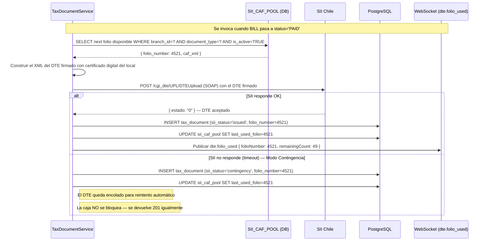

# Integraciones Externas — LabTab Backend

**Versión**: 1.0  
**Fase**: Venta — integraciones en modo sandbox/simulado  
**Stack**: Java 21 + Spring Boot 3.3.x

Este documento define los contratos de integración con sistemas externos.
En la fase de venta, Webpay y SII operan en sandbox/contingencia. La estructura
de código está preparada para activar producción cambiando una variable de entorno.

---

## 1. Transbank / Webpay Plus

**Tipo**: Gateway de pago con tarjeta  
**Fase actual**: Sandbox (credenciales de prueba)  
**Documentación oficial**: https://www.transbankdevelopers.cl/

### 1.1 Flujo de integración

```mermaid
sequenceDiagram
    participant Cliente as Cliente QR
    participant API as LabTab API
    participant TB as Transbank API
    participant DB as PostgreSQL

    Note over Cliente,DB: INICIO DE TRANSACCIÓN

    Cliente->>API: POST /payments { method: "WEBPAY", amount: 9500 }
    API->>DB: Crea PAYMENT con status='PENDING', buy_order generado
    API->>TB: POST /rswebpaytransaction/api/webpay/v1.2/transactions
              { buy_order, session_id, amount, return_url }
    TB-->>API: { token, url }
    API-->>Cliente: 201 { data: { redirectUrl: "https://webpay3g.transbank.cl/?token=abc123" } }

    Note over Cliente,TB: El cliente paga en la página de Transbank

    Cliente->>TB: Completa el pago con su tarjeta
    TB->>API: POST /payments/webhook/transbank (redirect return_url)
    API->>TB: PUT /transactions/{token} (confirmar la transacción)
    TB-->>API: { vci: "TSY", amount, status: "AUTHORIZED", authorization_code }

    API->>DB: UPDATE payment SET status='COMPLETED', authorization_code=..., gateway_response_json=...
    API->>DB: UPDATE bill SET paid_total+=amount, balance_due-=amount
    API-->>Cliente: 200 con estado de la cuenta actualizado
```

### 1.2 Configuración en `application.yml`

```yaml
transbank:
  env: ${TRANSBANK_ENV:sandbox}           # sandbox | production
  commerce-code: ${TRANSBANK_COMMERCE_CODE}
  api-key: ${TRANSBANK_API_KEY}
  webpay-url:
    sandbox: https://webpay3gint.transbank.cl
    production: https://webpay3g.transbank.cl
```

### 1.3 Credenciales de Sandbox

```bash
# Transbank proporciona estas credenciales por defecto para sandbox
TRANSBANK_COMMERCE_CODE=597055555532
TRANSBANK_API_KEY=579B532A7440BB0C9079DED94D31EA1615BACEB29610EC930C568E5B8CEDDEF7
TRANSBANK_ENV=sandbox
```

### 1.4 Implementación del cliente HTTP

```java
// configurations/TransbankConfiguration.java
@Configuration
public class TransbankConfiguration {

    @Value("${transbank.env}")
    private String env;

    @Value("${transbank.commerce-code}")
    private String commerceCode;

    @Value("${transbank.api-key}")
    private String apiKey;

    @Bean
    public WebpayPlus.Transaction transbankTransaction() {
        // SDK oficial de Transbank — configuración única por perfil
        if ("production".equals(env)) {
            return new WebpayPlus.Transaction(
                new WebpayOptions(commerceCode, apiKey, IntegrationApiKeys.WEBPAY_KEY,
                    Environment.Production)
            );
        }
        return new WebpayPlus.Transaction(
            new WebpayOptions(IntegrationCommerceCodes.WEBPAY_PLUS,
                IntegrationApiKeys.WEBPAY_KEY, Environment.Integration)
        );
    }
}
```

### 1.5 Validación del webhook de Transbank

```java
// services/implement/PaymentWebhookService.java
@Service
public class PaymentWebhookService {

    // Transbank no usa HMAC — confirma la transacción con PUT al mismo token
    // La "validación" es el hecho de que el token solo es conocido si el pago ocurrió
    public void processTransbankWebhook(String token, HttpServletRequest request) {

        // Confirmar la transacción en Transbank para obtener el resultado real
        WebpayPlus.Transaction.CommitResponse response =
            transbankTransaction.commit(token);

        // Verificar que el estado sea AUTHORIZED
        if (!"AUTHORIZED".equals(response.getStatus())) {
            log.warn("Transbank webhook con status no autorizado: {}", response.getStatus());
            return;  // El payment queda en status='FAILED'
        }

        // Buscar el PAYMENT por buy_order (generado al crear la transacción)
        Payment payment = paymentRepository.findByBuyOrder(response.getBuyOrder())
            .orElseThrow(() -> new ResourceNotFoundException("PAYMENT no encontrado"));

        // Actualizar el pago con los datos del gateway
        payment.setStatus(PaymentStatusEnum.COMPLETED);
        payment.setAuthorizationCode(response.getAuthorizationCode());
        payment.setExternalTransactionId(token);
        payment.setGatewayResponseJson(objectMapper.valueToTree(response));
        payment.setPaidAt(Instant.now());

        paymentRepository.save(payment);

        // Actualizar el BILL y emitir eventos WebSocket
        billService.applyPayment(payment.getBillId(), payment.getAmount());
    }
}
```

---

## 2. MercadoPago — QR Dinámico

**Tipo**: Gateway de pago QR (escaneo desde app MP)  
**Fase actual**: Sandbox  
**Documentación oficial**: https://www.mercadopago.cl/developers/es/docs/qr-code

### 2.1 Flujo QR Dinámico

```mermaid
sequenceDiagram
    participant Cliente as Cliente (app MP)
    participant API as LabTab API
    participant MP as MercadoPago API
    participant DB as PostgreSQL

    API->>MP: POST /instore/orders/qr/seller/collectors/{userId}/pos/{externalPosId}/qrs
              { title, total_amount, items, external_reference }
    MP-->>API: { qr_data } (string para generar QR)
    API-->>Cliente: QR generado en pantalla del cliente

    Cliente->>MP: Escanea QR con app MercadoPago y paga
    MP->>API: POST /payments/webhook/mercadopago (IPN)
              { id, type: "payment", action: "payment.updated" }

    API->>MP: GET /v1/payments/{paymentId} (verifica el pago con el ID del IPN)
    MP-->>API: { status: "approved", external_reference, transaction_amount }

    API->>DB: UPDATE payment SET status='COMPLETED', external_transaction_id=paymentId
    API-->>API: Actualizar BILL + emitir payment.qr_received
```

### 2.2 Validación del webhook MercadoPago (IPN)

```java
// services/implement/PaymentWebhookService.java
public void processMercadoPagoIpn(String paymentId, HttpServletRequest request) {

    // MercadoPago firma el webhook con x-signature header
    String signature = request.getHeader("x-signature");
    String requestId = request.getHeader("x-request-id");

    // Validar la firma HMAC-SHA256 con el secret de MP
    validateMercadoPagoSignature(signature, requestId, paymentId);

    // Consultar el pago en la API de MP para obtener los detalles reales
    Payment mpPayment = mercadoPagoClient.payment().get(Long.valueOf(paymentId));

    if (!"approved".equals(mpPayment.getStatus())) {
        log.info("IPN de MP con status no aprobado: {}", mpPayment.getStatus());
        return;
    }

    // El external_reference es el billId de LabTab (seteado al crear el QR)
    UUID billId = UUID.fromString(mpPayment.getExternalReference());

    // Idempotencia: verificar si ya procesamos este paymentId
    if (paymentRepository.existsByExternalTransactionId(paymentId)) {
        log.info("IPN duplicado ignorado: paymentId={}", paymentId);
        return;
    }

    // Procesar el pago
    paymentService.completePayment(billId, mpPayment);
}
```

---

## 3. SII Chile — Emisión de DTE

**Tipo**: Documentos Tributarios Electrónicos (boletas y facturas)  
**Fase actual**: Modo contingencia — los DTE se encolan y se emiten cuando hay conectividad  
**Documentación oficial**: https://www.sii.cl/factura_electronica/

### 3.1 Tipos de DTE soportados

| Tipo | Código SII | Descripción |
|:---|:---|:---|
| Boleta Electrónica | 39 | Venta a consumidor final — no requiere RUT del comprador |
| Factura Electrónica | 33 | Venta a empresa — requiere RUT y razón social |

### 3.2 Flujo de emisión de DTE



### 3.3 Modo Contingencia SII

```java
// services/implement/TaxDocumentService.java
@Service
public class TaxDocumentService {

    // Emite DTE de forma asíncrona para no bloquear el flujo de cierre de caja
    @Async
    public void issueAsync(Bill bill) {
        try {
            issueDte(bill);
        } catch (SiiConnectionException e) {
            // Modo contingencia: guardar con status='contingency' y reintentar
            log.warn("SII no disponible — DTE en contingencia para bill={}", bill.getId());
            taxDocumentRepository.updateStatus(
                bill.getId(), SiiStatusEnum.CONTINGENCY
            );
            // El scheduler de reintento (cada 15 minutos) lo recogerá
        }
    }

    // Scheduler que reintenta los DTE en contingencia
    @Scheduled(fixedDelay = 900_000)  // cada 15 minutos
    public void retryContingencyDte() {
        List<TaxDocument> pendientes = taxDocumentRepository
            .findByStatus(SiiStatusEnum.CONTINGENCY);

        for (TaxDocument dte : pendientes) {
            try {
                submitToSii(dte);
                dte.setSiiStatus(SiiStatusEnum.ISSUED);
                taxDocumentRepository.save(dte);
                log.info("DTE en contingencia emitido exitosamente: folio={}", dte.getFolioNumber());
            } catch (SiiConnectionException e) {
                log.warn("SII sigue sin disponible para folio={}", dte.getFolioNumber());
            }
        }
    }
}
```

### 3.4 Gestión de folios CAF

```java
// services/implement/CafPoolService.java
@Service
public class CafPoolService {

    private final SiiCafPoolRepository cafPoolRepository;
    private final AlertEventPublisher alertPublisher;

    // Obtiene el siguiente folio disponible — operación crítica con lock pesimista
    @Transactional
    public int getNextFolio(UUID branchId, String documentType) {
        // Lock pesimista — dos emisiones simultáneas no pueden usar el mismo folio
        SiiCafPool caf = cafPoolRepository
            .findByBranchIdAndDocumentTypeForUpdate(branchId, documentType)
            .orElseThrow(() -> new BusinessRuleException("CAF_EXHAUSTED",
                "No hay folios CAF disponibles para " + documentType));

        int nextFolio = caf.getLastUsedFolio() + 1;

        if (nextFolio > caf.getFolioTo()) {
            throw new BusinessRuleException("CAF_EXHAUSTED", "CAF agotado — cargar nuevo CAF del SII");
        }

        caf.setLastUsedFolio(nextFolio);
        cafPoolRepository.save(caf);

        // Alerta cuando quedan menos de 50 folios
        int remaining = caf.getFolioTo() - nextFolio;
        if (remaining < 50) {
            alertPublisher.publishFolioAlert(branchId, documentType, nextFolio, remaining);
        }

        return nextFolio;
    }
}
```

---

## 4. Estructura para Agregar Nuevos Proveedores de Pago

La arquitectura está diseñada para agregar nuevos gateways sin modificar el modelo
de `PAYMENT` ni el servicio principal `PaymentService`.

### 4.1 Patrón Strategy para gateways

```java
// services/payment/PaymentGatewayStrategy.java — interfaz común
public interface PaymentGatewayStrategy {

    // Inicia el proceso de pago — devuelve URL de redirect o datos QR
    PaymentInitResponse initiate(Bill bill, CreatePaymentRequest request);

    // Procesa el webhook/IPN del gateway
    void processWebhook(HttpServletRequest request, Map<String, String> params);

    // Identifica qué proveedor maneja esta estrategia
    String getProvider();
}

// services/payment/TransbankStrategy.java
@Service
public class TransbankStrategy implements PaymentGatewayStrategy {
    @Override public String getProvider() { return "transbank"; }
    // implementación...
}

// services/payment/MercadoPagoStrategy.java
@Service
public class MercadoPagoStrategy implements PaymentGatewayStrategy {
    @Override public String getProvider() { return "mercadopago"; }
    // implementación...
}

// Agregar un nuevo proveedor: solo crear una nueva clase @Service que implemente
// PaymentGatewayStrategy — el PaymentService la detecta automáticamente por inyección de lista
```

### 4.2 Registro automático de estrategias

```java
// services/implement/PaymentServiceImpl.java
@Service
public class PaymentServiceImpl implements PaymentService {

    // Spring inyecta automáticamente todos los @Service que implementan PaymentGatewayStrategy
    private final Map<String, PaymentGatewayStrategy> strategies;

    public PaymentServiceImpl(List<PaymentGatewayStrategy> strategyList) {
        // Crea un mapa provider → estrategia para lookup O(1)
        this.strategies = strategyList.stream()
            .collect(Collectors.toMap(
                PaymentGatewayStrategy::getProvider,
                Function.identity()
            ));
    }

    public PaymentInitResponse initiate(CreatePaymentRequest request) {
        PaymentGatewayStrategy strategy = strategies.get(request.provider());
        if (strategy == null) {
            throw new BusinessRuleException("PROVIDER_UNSUPPORTED",
                "Proveedor no soportado: " + request.provider());
        }
        Bill bill = billRepository.findById(request.billId()).orElseThrow(...);
        return strategy.initiate(bill, request);
    }
}
```

> Para agregar Apple Pay, Google Pay o Stripe en el futuro:
> 1. Crear clase `ApplePayStrategy implements PaymentGatewayStrategy`
> 2. Agregar el provider en `PaymentMethodEnum`
> 3. Completar `.env.example` con las nuevas variables de entorno
> 4. Agregar una fila en la migración `V7__create_payment_payment_method.sql` si el tipo necesita campos nuevos
>
> **No se modifica** el modelo `PAYMENT`, no se modifica `PaymentServiceImpl`, no se
> modifica el endpoint `POST /payments`. El patrón Strategy aísla completamente cada gateway.

---

## 5. Tarjetas de Crédito/Débito Manuales (CARD / CASH / TRANSFER)

Para pagos presenciales donde el cajero registra el pago manualmente
(efectivo, tarjeta con POS físico, transferencia bancaria):

```java
// No hay integración externa — el pago se registra directamente en la DB
// con method = CASH / CARD / TRANSFER y sin external_transaction_id
POST /payments {
    "billId": "uuid-bill",
    "amount": 15000,
    "method": "CASH",
    "provider": "manual",
    // No incluir externalTransactionId — el campo queda null
    "currency": "CLP"
}
```

> Los pagos manuales no tienen idempotencia por `external_transaction_id` (es null).
> El control de duplicado para pagos manuales es responsabilidad del cajero.
> El sistema no previene crear dos pagos en efectivo por el mismo monto en el mismo BILL —
> esta es una decisión operativa, no de sistema.
